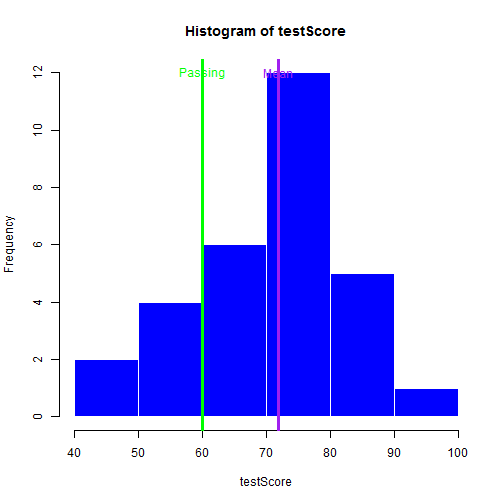

What is the % Pass When the Passing Grade Changes?
========================================================
author: treepruner
date: 2016-05-29
autosize: true

Overview
========================================================
This application includes a data set of student test scores and 
allows the user to model what happens when the passing scored is changed.

The default passing score is 60.

URL: https://treepruner.shinyapps.io/ImprovePassRate/


Initial Load
========================================================
The following are displayed:

- histogram 
- vertical line for the mean
- vertical line for the default passing score of 60


Histogram
========================================================





Passing Grade Changed
========================================================
The user changes the passing score and observes changes in 
- # passed
- % passed


Calculations
========================================================

```
  Passed Count
1  FALSE     6
2   TRUE    24
```
          PercentPassed is 80

